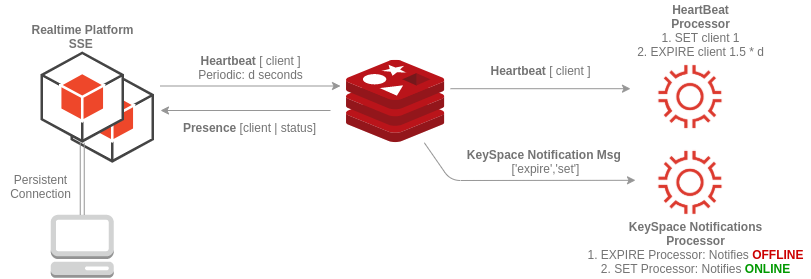
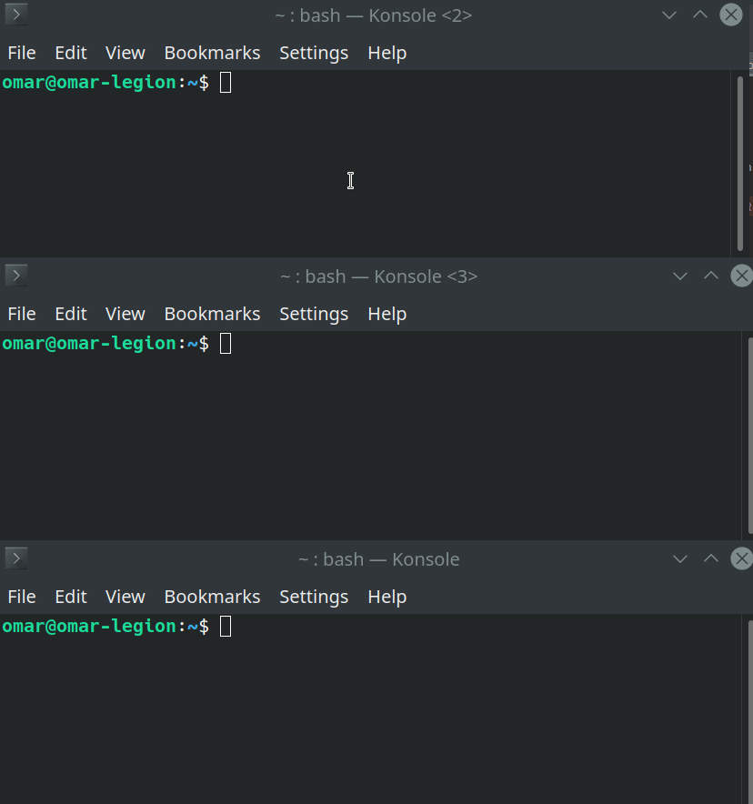

# Overview
The goal is to implement a `presence platform` based on Spring Boot SSE and Redis (Streams, RedisGears, KeySpace-Notifications )



`Realtime Platform` will have two channels - Redis Streams -with the Presence Platform: 
* `Heartbeat Upstream`: RT platform will periodically publish ONLINE client ids - `[ client ]` - to the `Presence Platform`. 
* `Presence Downstream`: Presence platform will publish presence messages -  `[ client | status: ]` to `presence` stream. 

`Presence platform` logic will be implemented as [RedisGears](https://oss.redis.com/redisgears) functions as event processors: [Heartbeat](./presence-platform/rg-heartbeat-processor.py) 
and [KeySpace notification event processors](./presence-platform/rg-keyspace-notifications-processor.py). 

## How to run 

```bash
$ git clone https://github.com/oalles/redis-presence
$ cd redis-presence/realtime-service;mvn clean install;cd ../deployment
$ docker-compose up # --build
```
#### Enable Key Space Notifications
You can use [RedisInsights](https://github.com/redisinsight/redisinsight) as GUI.
in order to set:  `CONFIG SET notify-keyspace-events Kxs`

See the configuration description [here](https://redis.io/docs/manual/keyspace-notifications/#configuration).

#### Load RG scripts
In a given python virtual env, install requirements and run `init.py`. 

## Must Read
> Key expiration IS NOT REAL TIME, while it seems like a real time if you try on local (small key), it’s already stated in the doc that the key might not be notified real time upon expiration event due to redis expiration logic (read the Timing of expired events section of the doc)

[Timing of Expired Events](https://redis.io/docs/manual/keyspace-notifications/#timing-of-expired-events)

## Useful Links:
* [Keyspace Notifications](https://redis.io/docs/manual/keyspace-notifications/)
* [Keyspace Notifications how to](https://medium.com/nerd-for-tech/redis-getting-notified-when-a-key-is-expired-or-changed-ca3e1f1c7f0a)
* [Redisgears](https://oss.redis.com/redisgears)
* [Keyspace notifications using RedisGears](https://medium.com/@vsharathis/redis-journey-and-keyspace-notification-processing-using-redisgears-6811edb888f8)
* [Redisgears Examples](https://oss.redis.com/redisgears/examples.html)
* [EXPIRE command](https://redis.io/commands/expire/)


## Standole Realtime - Local Push Registry
`1.LOCAL_PRESENCE` branch contains the standalone realtime service with a local push registry, no redis configuration.  ``


